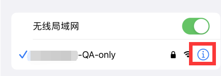
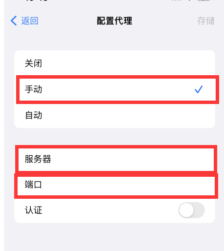
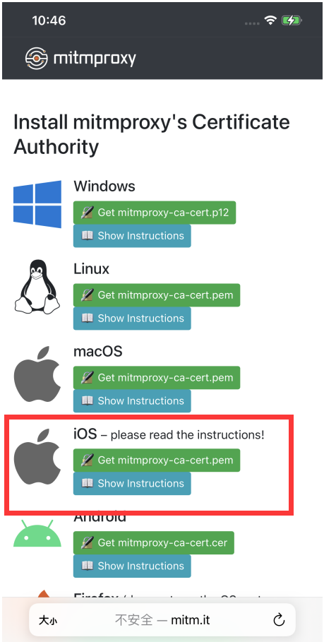
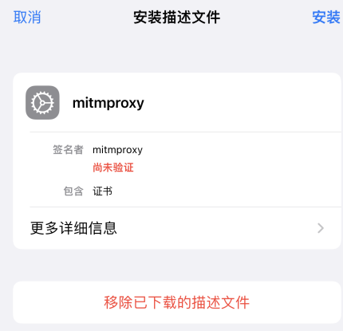
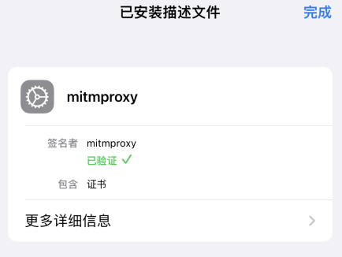
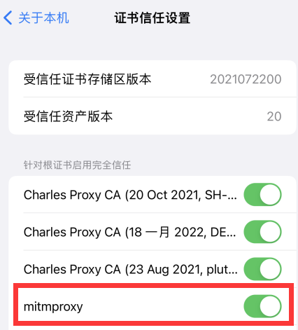

# 知乎文章自动下载器

### 想法来源

之前在用这个[知乎文章下载器项目（by chenluda）](https://github.com/chenluda/zhihu-download)，但是我想下载的文章太多了懒得一个一个复制url而且还要从手机复制到电脑里，就自己写了个自动下载的版本

### 针对用户

- 喜欢把游览记录当作收藏夹的小朋友
- 喜欢文章只看一半，结果后来遇到“你好像来到了知识不存在的荒原”的小朋友
- 想下载的文章太多了的小朋友

### 使用

1. pip install mitmproxy
2. 参照mitmproxy教程配置手机http代理（端口8080，或自行更改bat脚本）
3. 运行launch.bat
4. 在手机上游览知乎文章的时候程序会自动下载你看的文章到/download

### 注意事项

1. 在主页点进去文章不会自动下载、在游览记录点进去文章才会自动下载

### 附：mitmproxy手机代理配置流程（ios）

1. 手机、电脑连同一wifi
2. 获取计算机ip（终端输入ipconfig）
3. 打开iphone设置 - wifi - i按钮
   
4. 找到里面http代理一栏，选择“手动”，并输入第2步获得的电脑ip和脚本端口号（脚本里设为8080）到“服务器”和“端口”，记得点“存储”保存
   
5. 在safari游览器中访问[http://mitm.it/](http://mitm.it/)进行证书安装
   
6. 设置证书的信任：设置 -> 通用-> VPN与设备管理 ->  mitmproxy，点击进行安装
   
   安装成功
   
7. 证书的信任开关在：通用 -> 关于本机 -> 下拉到 证书信任设置 -> 找到mitmproxy
   
8. 完成这些后mitmproxy工具就可以获取你的手机http请求进行处理了
